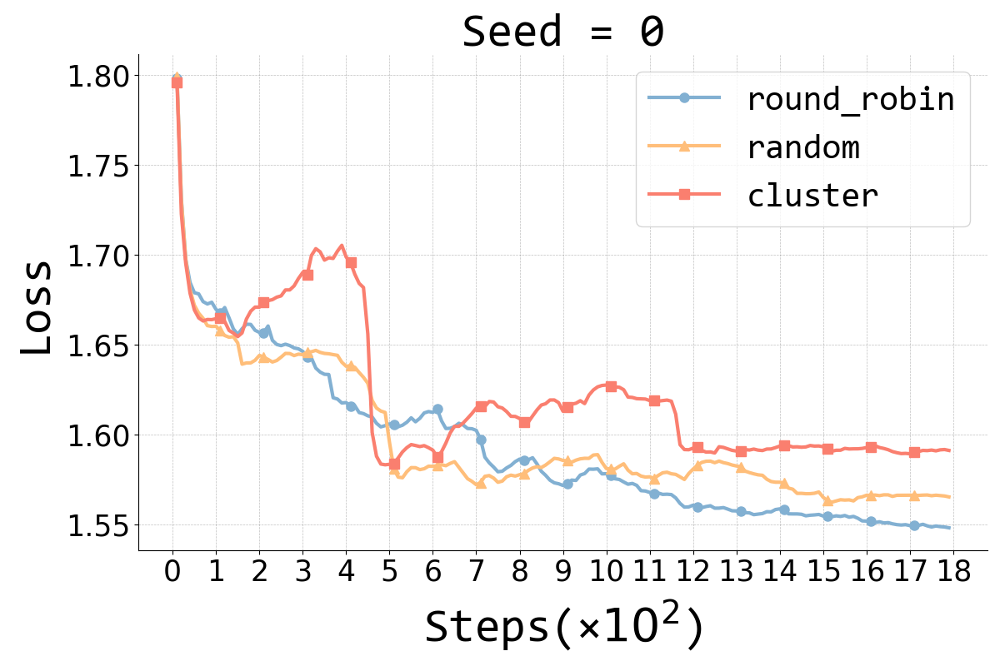

<div align="center">
    <h1>Dynamics of Zero-Shot Generalization</h1>
</div>
<p align="center">
  <a target="_blank">
    
  </a>
  <a target="_blank">
    
  </a>
</p>
<p align="center">
  <a href="#Contributions">Contributions</a> •
  <a href="#Positioning">Positioning</a> •
  <a href="#Facilitation">Facilitation</a> •
  <a href="#Understanding">Understanding</a>
</p>


The repository contains the code for the paper, aiming to provide the source code necessary to reproduce the experimental results. Our key contributions are as follows:

## ✨ Contributions

- We find that **zero-shot generalization occurs during the very early stage of instruction tuning**, despite the metrics chosen for measurement, while **loss serves as a reasonable and suitable metric to measure zero-shot generalization** due to its stability and fairness across datasets.
- We identify two entry points to gain a deeper understanding of zero-shot generalization: **similarity** and **granularity**, confirming that encountering highly similar and fine-grained training data earlier during instruction tuning, without the constraints of defined ``tasks'', enables better generalization.
- We propose the **Test-centric Multi-turn Arrangement (TMA)**, a more grounding training data arrangement method, and show that accessing high-similarity data during instruction tuning can facilitate continued learning and further loss reduction.

<div><a id="Introduction"></a></div>

## 📖 Introduction

Understanding alignment techniques begins with comprehending zero-shot generalization brought by instruction tuning, but little of the mechanism has been understood. 

Existing work has largely been confined to the task level, without considering that tasks are artificially defined and, to LLMs, merely consist of tokens and representations. This line of research has been limited to examining transfer between tasks from a task-pair perspective, with few studies focusing on understanding zero-shot generalization from the perspective of the data itself.

<div><a id="Positioning"></a></div>

## 🛠️ Positioning Zero-Shot Generalization

### Settings

We utilize three multi-task datasets, namely [Natural Instructions V2 (NIV2)](https://github.com/allenai/natural-instructions), [Public Pool of Prompts (P3)](https://huggingface.co/datasets/bigscience/P3), and [Flan-mini](https://huggingface.co/datasets/declare-lab/flan-mini), for our analysis.

- For NIV2, we utilized the default track and default training-test split for instruction tuning and evaluation.
- For P3, we employed training and test tasks consistent with the vanilla T0 model. 
- For Flan-mini, we randomly partitioned the training and test tasks.

We choose pre-trained [LLaMA-2-7B](https://huggingface.co/meta-llama/Llama-2-7b) as our base model.

### Usage

We utilize the [model-center](https://github.com/OpenBMB/ModelCenter) framework to conduct full-parameter fine-tuning of LLaMA-2-7B on two 80GB A800s. Take NIV2 as an example, specific hyper-parameters can be tuned in `scripts/sft_on_ni.sh`. Here are some parameters need to check:

- `model_name_or_path`: Path to the LLaMA-2-7B base model weights. Note that the weights should be transformed from huggingface weight to bmtrain weight using the script provided **[here](https://github.com/OpenBMB/ModelCenter/blob/main/transfer/hugLLaMa2_bmtrainLLaMa2.py).**
- `data_dir`: Path to the training data with conversation records.
- `save_dir`: Path to the saved checkpoints.

Just run the script in the root of repo to start training:

```shell
bash scripts/sft_on_ni.sh
```

For evaluation using metrics like ROUGE-1, ROUGE-L, Exact-Match, RM and Loss scores used in paper, run the following script first:

```shell
bash scripts/gen_on_ni.sh
```

After generating the answer for each instruction in test dataset, we then calculate the specific evaluation metric for zero-shot generalization:

- For ROUGE-1, ROUGE-L and Exact-Match scores: `bash scripts/gen_on_ni.sh` has already automatically calculated the metrics, check the `output_dir` in `scripts/gen_on_ni.sh`
- For Reward Model score: We use [UltraRM-13B](https://huggingface.co/openbmb/UltraRM-13b) as the reward model. Run the script using `bash eval_by_rm.sh` will automatically score the generations using RM.
- For Loss score: Run the script using `bash eval_by_loss.sh` directly will automatically calculate the loss for each data as instruction tuning.

#### Results

<figure style="text-align: center;">
    <div style="display: flex; justify-content: space-around;">
        
        
        
    </div>
    <figcaption><b>Figure 1: Average ROUGE-1, ROUGE-L, and Exact-Match scores (left), average RM scores (middle), and average loss scores (right) of checkpoints fine-tuned on NIV2 (left, middle, right), P3 (middle, right), and Flan-mini (middle, right), all evaluated on unseen tasks.</b></figcaption>
</figure>

<div><a id="Facilitation"></a></div>

## 🎮 Facilitation

### Effect of Training Data Permutations

#### Settings

We employ loss as an indicator and analyze how training data permutations affect zero-shot generalization. Then we begin our study by conducting a preliminary experiment on Flan-mini, investigating the impact of exposure to different training data permutations during the early stage of instruction tuning.

#### Usage

We first generate three permutations of training data using the following script:

```shell
python data/split_cluster.py
```

It will generate the three settings mentioned in the paper:

- **Round-robin**: We employ round-robin scheduling to disperse training tasks as much as possible. Consequently, the model iterates over one data point from each task every 100 training steps.
- **Cluster**: We arrange all data from each task together, resulting in task-level clusters throughout the entire training dataset. Consequently, the model trains on 8 new tasks every 10 steps.
- **Random**: We randomly shuffle all training data as a baseline for comparison. 

We then instruction tuning LLaMA-2-7B on three permutations respectively using: 

```shell
bash scripts/sft_on_flan.sh
```

And then evaluate these fine-grained instruction-tuned checkpoints using:

```shell
bash scripts/eval_by_loss.sh
```

#### Results

<figure style="text-align: center;">
    <div style="display: flex; justify-content: space-around;">
        
        
        
    </div>
    <figcaption><b>Figure 2: Sudden decrease in the average loss under cluster scheduling for the three tasks at steps 400 (coqa:1.0.0), 450 (task851), and 150 (task900), respectively.</b></figcaption>
</figure>


### Effect of High-Similarity Data

#### Settings

We utilize the Flan-mini dataset and randomly sample up to 20 instances for each training task. Each test task consists of at most five test data points to form a test set. We permute the training data based on the **Weighted Similarity Distance (WSD)** measure:
$$
WSD_i = w_\text{avg}AD_i + w_\text{min}MD_i
$$
We examine three training permutations: Nearest First Training (NFT), Farthest First Training (FFT), and Random Training (RT)

- **NFT**:  Given a certain similarity distance measure such as Weighted Similarity Distance (WSD), we compute the similarity distance from each training data point to the test set based on this measure, and then permute the training data points from nearest to farthest.
- **FFT**: Given a certain similarity distance measure such as Weighted Similarity Distance (WSD), we calculate the similarity distance from each training data point to the test set based on this measure, and then permute the training data points from farthest to nearest.
- **Random**: As a baseline, we randomly shuffle all training data.

#### Usage

Firstly, use the following script to generate training and test dataset in NFT setting of Flan-mini:

```shell
bash script/split_data_job.sh
```

Then we respectively instruction tuning LLaMA-2-7B under three settings using different hyper-parameters in

```shell
bash scripts/sft_job.sh
```

*(NOTE: the script ends with "job" is running on clusters so there are several configurations need to be changed.)*

At last, we also evaluate our fine-grained instruction-tuned checkpoints using:

```shell
bash scripts/eval_by_loss.sh
```

### Effect of Fine-Grained Data

#### Settings

We use the Flan-mini dataset and randomly sample up to 20 instances for each training task. We employ two approaches to permute the training data:

- **coarse-grained setting**: where all instances under each training task are clustered and then shuffled. We define the embedding of a task as the average embedding of all instances under that task.
- **fine-grained setting**: where all data instances are directly shuffled instead of first being clustered.

#### Usage

Firstly, use the following script to generate training and test dataset in these two settings of Flan-mini:

```shell
bash script/split_data_job.sh
bash script/split_data_coarse_job.sh
```

Then we respectively instruction tuning LLaMA-2-7B under these settings in

```shell
bash scripts/sft_job.sh
```

*(NOTE: the script ends with "job" is running on clusters so there are several configurations need to be changed.)*

At last, we also evaluate our fine-grained instruction-tuned checkpoints using:

```shell
bash scripts/eval_by_loss.sh
```

### Results

<figure style="text-align: center;">
    <div style="display: flex; justify-content: space-around;">
        
        
    </div>
    <figcaption><b>Figure 3: The impact of the three similarity settings (NFT, FFT, and RT) on averaged test loss is depicted on the left, while the influence of different granularity settings on the loss is shown on the right.</b></figcaption>
</figure>

<div><a id="Understanding"></a></div>

## 📊 Understanding

### Test-centric Multi-turn Arrangement (TMA)

<figure style="text-align: center;">
    <div style="display: flex; justify-content: space-around;">
        
    </div>
    <figcaption><b>Algorithm 1: Test-centric Multi-turn Arrangement Method</b></figcaption>
</figure

#### Settings

We employed two types of datasets:

- Datasets with task splits, such as Flan-mini.
- Datasets without task splits, such as [ShareGPT](https://huggingface.co/datasets/openchat/openchat_sharegpt4_dataset) and [NoRobots](https://huggingface.co/datasets/HuggingFaceH4/no_robots). 

Flan-mini consists of task-specific splits, while ShareGPT and NoRobots are general dialogue datasets. We select the training data by applying **TMA** algorithm and examine the same three training permutations, namely NFT, FFT, and RT. For detailed configurations, please refer to Appendix C.

#### Usage

Taking Flan-mini as an example, firstly, use the following script to generate training and test dataset in three settings:

```shell
bash script/convert_flan_data_job.sh
```

*(NOTE: the script ends with "job" is running on clusters so there are several configurations need to be changed.)*

Then we respectively instruction tuning LLaMA-2-7B under these settings in

```shell
bash scripts/sft_job.sh
```

*(NOTE: the script ends with "job" is running on clusters so there are several configurations need to be changed.)*

At last, we also evaluate our fine-grained instruction-tuned checkpoints using:

```shell
bash scripts/eval_by_loss.sh
```

#### Results

<figure style="text-align: center;">
    <div style="display: flex; justify-content: space-around;">
        
        
        
    </div>
    <figcaption><b>Figure 4: Averaged test loss of three similarity settings (NFT, FFT, and RT) under Test-centric Multi-turn Arrangement on Flan-mini (left), ShareGPT (middle), and NoRobots (right).</b></figcaption>
</figure>


### Effect of Early-Selected Sub-Training Set

#### Settings

We apply Flan-mini as in the previous experiment. Specifically, we cluster the training data selected from rounds $[i, i+5)\ (i = 0, 5, 10, 15, 20, 25)$ based on **TMA**, and respectively perform instruction tuning for comparison. Then, for each instruction-tuned checkpoint, we calculate the average loss on the test set.

#### Usage

The usage scripts are the same as above, just some modification in the hyper-parameters.

#### Results

<figure style="text-align: center;">
    <div style="display: flex; justify-content: space-around;">
        
        
    </div>
    <figcaption><b>Figure 5: Averaged test loss on different turns of training data (left), and on five similarity settings under Test-centric Multi-turn Arrangement on Flan-mini (right).</b></figcaption>
</figure>

## Citation

Please cite us if it is useful in your work:

```
TODO
```
